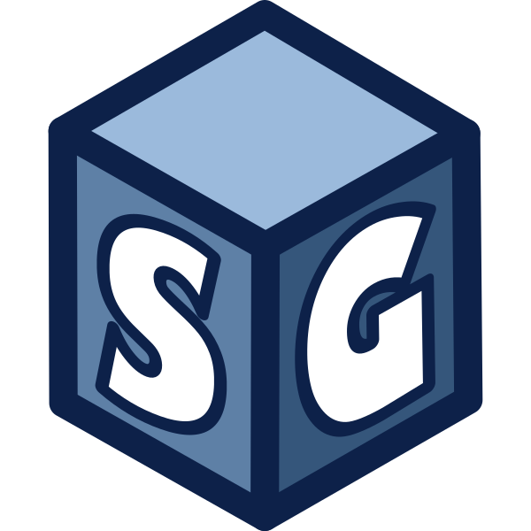

<div align='center'>
   
   
  <div id="toc">
    <ul style="list-style: none;">
      <summary>
        <h1>Shapes Generator 1.4.0</h1>
      </summary>
    </ul>
  </div>
</div>

## 📌 Description

This project is a console-based **Shape Generator** written in **C++**. It allows users to create and save various **3D shapes** such as:

🔴 Sphere | 🔷 IcoSphere | ▭ Plane | 🧊 Cube | 🛢 Cylinder | ⬢ Hexagon | 🍦 Cone | 🔼 Tetrahedron | 🔺 Pyramid | 🍩 Torus

The program dynamically generates the shape based on user input and exports the shape data to a file.
> 🧭 Note: All shapes use the counterclockwise order for listing vertices, which ensures consistency and simplifies rendering in most 3D engines.

> 🔺 Note: Each shape is constructed using triangles.

🛠 **Technologies used:**
- [**GLM**](https://github.com/g-truc/glm) (OpenGL Mathematics) for vector operations
- [**FMT**](https://github.com/fmtlib/fmt) for formatted output
- [**JSON**](https://github.com/nlohmann/json) for exporting in json format

## 📋 Table of Contents

- [✨ Features](#-features)
- [📦 Dependencies](#-dependencies)
- [⚙️ How to Build](#%EF%B8%8F-how-to-build)
   - [🖥️ Windows](#%EF%B8%8F-windows)
   - [🐧 Linux](#-linux)
   - [🍏 MacOS](#-macos)
- [▶️ Usage](#%EF%B8%8F-usage)
- [🧾 Configuration](#-configuration)
- [📜 Example Output](#-example-output)
- [🛠 Troubleshooting](#-troubleshooting)
- [👨‍💻 Authors](#-authors)
- [📜 License](#-license)

## ✨ Features

✅ **Interactive User Input**
   - Configure shapes through console input.
   - Choose from **ten** different shapes:
     1.  🔴 Sphere
     2.  🔷 IcoSphere
     3.  ▭ Plane
     4.  🧊 Cube
     5.  🛢 Cylinder
     6.  ⬢ Hexagon
     7.  🍦 Cone
     8.  🔼 Tetrahedron
     9.  🔺 Pyramid
     10. 🍩 Torus

✅ **ESC Key Support**: Press **ESC** anytime to exit the program.
<br/>
✅ **File Output**: Generated shapes are saved in `shape.txt`, `shape.obj` or `shape.json` for later use.
<br/>
✅ **Error Handling**: Provides feedback for invalid inputs and applies sensible defaults.

## 📦 Dependencies

- **C++20** or later
- **CMake 3.26** or later
- [**GLM**](https://github.com/g-truc/glm) Library (OpenGL Mathematics)
- [**FMT**](https://github.com/fmtlib/fmt) Library (Formatted console output)
- [**JSON**](https://github.com/nlohmann/json) Library (Exporting in JSON format)

## ⚙️ How to Build

### 🖥️ Windows

1. **Clone the repository:**

   ```bash
   > git clone https://github.com/Muppetsg2/Shapes-Generator.git
   > cd Shapes-Generator
   ```

2. **Open the folder in Visual Studio** (supports CMake natively).
3. CMake will **configure** the project and **download** dependencies automatically via `CPM.cmake`.
4. **Press ▶️** to build and run the app.

### 🐧 Linux

1. **Clone the repository:**

   ```bash
   > git clone https://github.com/Muppetsg2/Shapes-Generator.git
   > cd Shapes-Generator
   ```

2. **Install CMake and a compiler** (if not installed):

   ```bash
   > sudo apt install cmake g++ ninja-build
   ```

3. **Build the project**:

   ```bash
   > cmake -B build -G Ninja -DCMAKE_BUILD_TYPE=Release
   > cmake --build build
   ```

4. **Run the app**:

   ```bash
   > ./build/bin/Shapes-Generator
   ```

### 🍏 MacOS

1. **Clone the repository:**

   ```bash
   > git clone https://github.com/Muppetsg2/Shapes-Generator.git
   > cd Shapes-Generator
   ```

2. **Install dependencies (CMake, Ninja, compiler)** (if not installed):

   ```bash
   > brew install cmake ninja
   ```

3. **Build the project with app bundle**:

   ```bash
   > cmake -B build -G Ninja -DCMAKE_BUILD_TYPE=Release
   > cmake --build build
   ```

4. **Run the app**:

   ```bash
   > open build/bin/Shapes-Generator.app
   ```

## ▶️ Usage

1. **Launch the program** - ASCII art and a menu will appear.
2. **Select a shape** by entering a number (1-10).
3. **Enter the required shape parameters**, if applicable.
4. **The shape is generated**.
5. **Select the file format** for saving.
6. **The file path** will be displayed in the console.
7. *(Optionaly)* **File explorer** will pop up with file location.
8. **Exit anytime** by pressing the **ESC** key.

## 🧾 Configuration

The application allows you to configure the default output path and filename using the `shapes.config` file.

**Example contents** of `shapes.config`:

   ```bash
   generateTangents: true
   calculateBitangents: true
   tangentHandednessPositive: true
   saveDir: C:\my\custom\output\
   fileName: my_${TYPE}-%H-%M-%S
   openDirOnSave: true
   ```

- **generateTangents**: Tells the generator whether to compute and include tangent vectors for each vertex (useful for normal mapping and advanced shading).
If `calculateBitangents` is enabled, bitangent vectors will also be generated for each vertex.
- **calculateBitangents**: Determines whether bitangent vectors should be calculated and included in the saved file.
- **tangentHandednessPositive**: Defines which handedness convention should be used when calculating bitangents or when saving tangents to the file.
- **saveDir**: Sets the directory where shape files will be saved.
- **fileName**: Defines the pattern for the output file name. You can use **standard time format markers**
compatible with the C++ function **strftime**, as well as a custom placeholder `${TYPE}`, 
which will be replaced with the name of the generated 3D object (e.g., `"Cube"`, `"Cone"`, `"Sphere"`).
- **openDirOnSave**: If enabled, instructs the application to open the system file explorer at the location of the saved file after generation.

### 🧩 Custom markers

| Marker | Description | Example |
| ------ | ----------- | ------- |
| `${TYPE}` | Name of the 3D object being generated | `Sphere` |

> 💡 If the config file is missing or malformed, defaults will be used.\
:information_source: The path will be different depending on your operating system. Here is an example of the path for Windows \
⏱️ List of all supported time marks you can find [here](https://cplusplus.com/reference/ctime/strftime/)

## 📜 Example Output

When generating a **Sphere**, the output will look like this:
```mathematica
[OK] Start Generating Sphere...
[OK] Sphere Generated Successfully!

[INFO] Shape successfully generated in 4.51e-05s!

──────────────────────────────────────────────────
[FILE] Select the save format:
 1) std::vector — Vertices & Indices (struct)
 2) C array     — Vertices & Indices (struct)
 3) std::vector — Vertices only (struct)
 4) C array     — Vertices only (struct)
 5) std::vector — Vertices & Indices (float)
 6) C array     — Vertices & Indices (float)
 7) std::vector — Vertices only (float)
 8) C array     — Vertices only (float)
 9) Export — JSON — Vertices & Indices
 10) Export — JSON — Vertices only
 11) Export — OBJ
 ──────────────────────────────────────────────────
Enter your choice (1 - 11): 1

[OK] Start Saving Sphere to file...
[SAVED] Shape saved successfully in 0.0013585s!
[PATH] File path: C:\my\custom\output\my_shape.txt

Press Enter to exit...
```

> :information_source: This example is shown on a Windows system. It may vary on other systems.

## 🛠 Troubleshooting

❌ **Issues? Try this:**
- Ensure **all dependencies** are installed.
- Check **console messages** for errors.
- Verify you're using **C++20** or later.

> :information_source: If you cannot see or understand the error, [open an issue](https://github.com/Muppetsg2/Shapes-Generator/issues).

## 👨‍💻 Authors

📌 **Marceli Antosik (Muppetsg2)**

## 📜 License

This project is **open-source** under the **MIT License**.

📖 **MIT License Overview:**
- ✅ Free to use, modify, and distribute.
- ✅ Can be used in **commercial** and **non-commercial** projects.
- ❗ Must include original license and copyright.

See the [LICENSE](./LICENSE) file for details.
